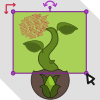

<!-- *** UPDATE THIS FOR EACH REPO *** -->
# Blog
An attempt at making a small Blog website.

<!-- PROJECT LOGO -->
<br />
<p align="center">
  <a href="https://github.com/Yuugen64/">
    
  </a>

  <h3 align="center">Blog</h3>
  
  <br />
  </p>
</p>


<!-- TABLE OF CONTENTS -->
## Table of Contents

* [About the Project](#about-the-project)
  * [Built With](#built-with)
* [Getting Started](#getting-started)
  * [Prerequisites](#prerequisites)
  * [Installation](#installation)
* [Usage](#usage)
* [Contact](#contact)
* [Acknowledgements](#acknowledgements)


<!-- ABOUT THE PROJECT -->
## About The Project

<!-- [![Product Name Screen Shot][product-screenshot]](https://example.com) -->


### Created With
* VS Code
* ReactJS
* NodeJS


<!-- GETTING STARTED -->
## Getting Started

The intent is to host this as my very first media platform to author content on, and manage as a web developer. Alternatively, you may download the zip and open it locally if you feel comfortable doing so to view the code.


### Prerequisites

No prerequisites.
```sh
```

### Installation

1. Click the green download button to get the .zip!


<!-- USAGE EXAMPLES -->
## Usage
- N/a

<!-- CHANGELOG -->
## Changelog:
<!-- DATES and what changed/was accomplished on that day. -->

7.29.21:
- Initialized the repo.
- [000-0.0.0]:: Initial Commit >> Updated the readme with my standard format. Verifying Git pipeline.
- [001-0.0.1]:: ReactJS Template >> Created the ReactJS template inside of a sub-directory since capital letters are no longer allowed inside of project names.-
- [002-0.0.2]:: Cleaned Up >> Removed some of the unnecessary bits that come pre-packaged with ReactJS template.
- [003-0.0.3]:: Menubar >> Got a basic skeleton of a menubar together. Also put together a basic color palette.
- [004-0.0.3]:: Local Image >> Got a local image rendering properly in ReactJS.
- [005-0.0.3]:: BUGFIX >> When using Font-Awesome (FA) icons in ReactJS you need to remember to substitute the default syntax of 'class' for the icons with React's syntax 'className'. Doing so allows the CSS to actually apply to the icons.
- [006-0.0.4]:: Menubar Rough >> Completed the genral look of the Menubar. Like all components, I will return to them in a later stage to polish.
- [007-0.0.4]:: Homepage Stopping Point >> Working on roughing out the homepage.
- [008-0.0.5]:: Sidebar >> Roughed out the basic styling and positioning of the sidebar component on the right side.
- [009-0.0.5]:: Post Formatting >> Roughed the formatting of the individual post components.
- [010-0.0.6]:: Post(s) styling + Menubar fix >> Roughed out the styling of the multiple Posts component + fixed an issue where the menubar was behind certain text elements on the page.

7.30.21:
- [011-0.0.7]:: Roughed Out Post Content Page >> Will definitely have to come back to adjust font, sizing, colors, etc.
- [012-0.0.8]:: Create Post Page >> Roughed out the page where posts can be pieced together.
- [013-0.0.8]:: Update Settings Page >> Started working on a page where the user can update their account settings.
- [014-0.0.8]:: Settings Page >> Finished roughing out the update user settings page.


### Main Branch:
- Where the core project is located.

<!-- CONTRIBUTING -->
## Contributing

For this particular project, there have been no outside contributions. If that changes in the future I will be sure to update this section to accurately credit those authors.


<!-- CONTACT -->
## Contact

Yuugen64@protonmail.com

<!-- ***Make sure to update REPO in BOTH URLs here*** -->
Project Link: [https://github.com/Yuugen64](https://github.com/Yuugen64)


<!-- ACKNOWLEDGEMENTS -->
## Acknowledgements
* [Othneildrew](https://github.com/othneildrew/Best-README-Template/blob/master/README.md) - For providing a great template for leveling up my README!
* [Lama Dev](https://www.youtube.com/channel/UCOxWrX5MIdXIeRNaXC3sqIg) - Tutorial I used to get started.

